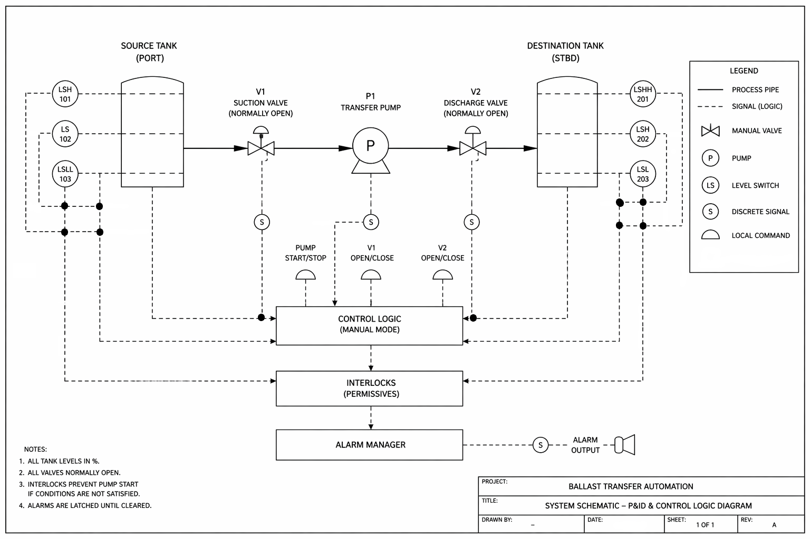
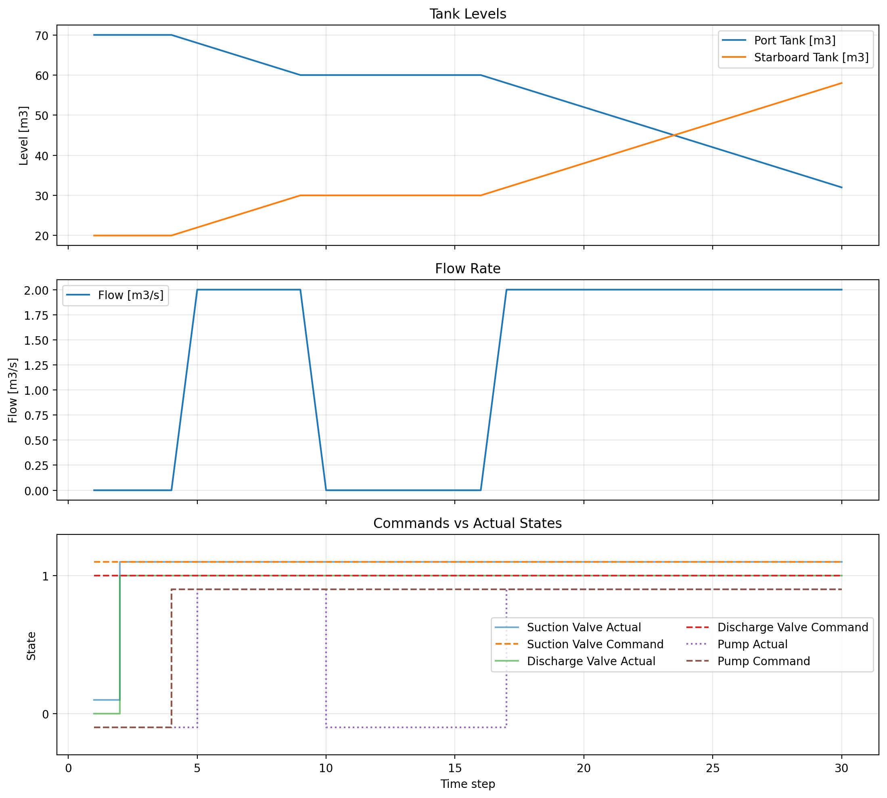

# Ballast Transfer Automation Simulator

A simplified simulation of a marine ballast transfer system combining  
**process modeling**, **control logic**, and **alarm handling**.

This project demonstrates how real industrial systems behave under:
- normal operation
- operator interaction
- fault conditions
- safety constraints (interlocks)

---

## System Overview

The system represents a basic fluid transfer loop:

- **Source Tank (Port)**
- **Destination Tank (Starboard)**
- **Suction Valve (V1)**
- **Transfer Pump (P1)**
- **Discharge Valve (V2)**

Fluid is transferred from the source tank to the destination tank  
through a controlled pipeline.

### System Diagram

---

## Control Architecture

The system is structured into layered logic, similar to real automation systems.

### 🔹 Process Layer
Physical components:
- Tanks (fluid storage)
- Pump (flow generation)
- Valves (flow control)

---

### 🔹 Control Logic (Manual Mode)
Handles operator commands:
- Pump start/stop
- Valve open/close

Implements system sequencing:
- `IDLE → OPENING_VALVES → TRANSFERRING → STOPPING`

---

### 🔹 Interlocks (Safety Layer)
Prevents unsafe operation by enforcing conditions:

- Source tank level must be above minimum
- Destination tank must not be overfilled
- Valves must be open before transfer
- Pump must be available

> Interlocks override commands if conditions are not satisfied.

---

### 🔹 Alarm Manager
Tracks abnormal conditions:

- Raises alarms when faults occur
- Clears alarms when conditions normalize
- Records **alarm lifecycle (start, end, duration)**

---

## Scenarios

The system is tested using predefined scenarios:

| Scenario | Description |
|--------|------------|
| `normal_manual_transfer` | Nominal operation |
| `operator_valve_closure_recovery` | Operator closes valve mid-transfer |
| `valve_fail_to_open` | Discharge valve stuck closed |
| `pump_fail_to_start` | Pump fails during operation |
| `source_low_low_trip` | Source tank reaches minimum level |
| `destination_high_high_trip` | Destination tank reaches maximum level |

Each scenario defines:
- time-dependent commands
- fault conditions
- initial system state

---

## Simulation Outputs

Each scenario produces diagnostic plots.

---

### Tank Levels

- Source tank level **decreases** during transfer  
- Destination tank level **increases**  
- Flat sections indicate **no flow (interlock or fault)**  

---

### Flow Rate

- Flow is present only when:
  - pump is running
  - valves are open  
- Drops to zero when:
  - pump fails
  - valve closes
  - interlock blocks operation  

---

### Commands vs Actual States

Shows difference between:
- **Commanded states** (operator intent)
- **Actual states** (system response)

Highlights:
- delays (valve opening, pump startup)
- failures (pump not starting, valve stuck)
- mismatches between logic and hardware

---

## Alarm System

The alarm system tracks full lifecycle events:

- **RAISED** → when condition occurs  
- **CLEARED** → when condition resolves  
- **DURATION** → how long alarm was active  

### Example
**Pump fails to start (6 steps, 11->17)**

This allows analysis of:
- transient faults
- persistent failures
- system recovery behavior

---

## Batch Simulation & Summary

All scenarios can be executed in batch mode.

### Output includes:

- Final tank levels  
- Whether transfer occurred  
- Alarm summary  
- Final sequence state  
- Last interlock reason  

### CSV Report

Generated report contains:

- `scenario`
- `transfer_occurred`
- `alarms_raised`
- `alarm_durations`
- `final_sequence`
- `last_interlock`

This enables quick comparison between system behaviors.

---

## Key Engineering Insights

This project demonstrates:

- Difference between **command vs actual system response**
- Importance of **interlocks over direct commands**
- Impact of **component failures on system performance**
- Use of **alarm lifecycle data for diagnostics**
- Behavior of systems under **dynamic and fault conditions**

---

## Tech Stack

- Python  
- Matplotlib (visualization)  
- Object-Oriented Programming (system modeling)  

---

## Future Improvements

Possible extensions:

- Automatic control mode (closed-loop control)
- HMI-style visualization (dashboard)
- More detailed physics (pressure, flow dynamics)
- Real-time simulation
- PLC-style logic expansion

---

## Summary

This project connects:

- **Mechanical systems** → tanks, pump, valves  
- **Automation logic** → control sequences, interlocks  
- **Monitoring systems** → alarms, diagnostics  

It reflects how real industrial and marine systems are:
- designed  
- tested  
- analyzed  

---